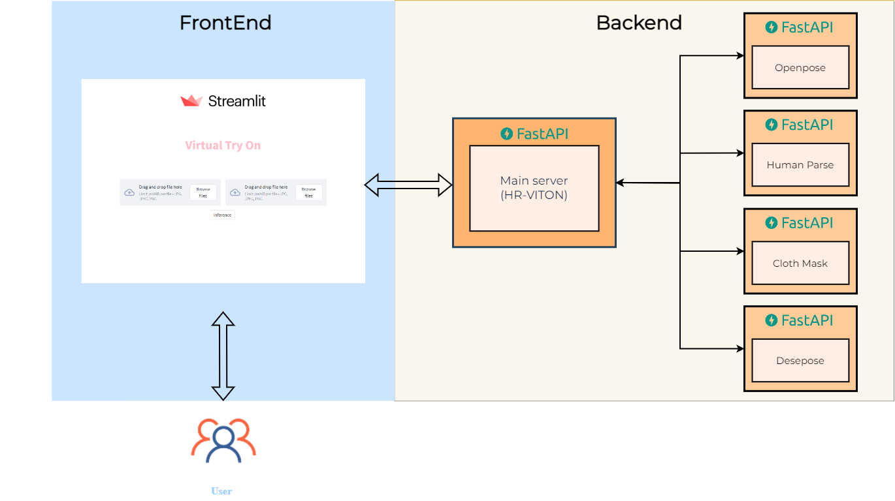

# :shirt: Fit me Up!

CV-10
## 조물주 김영민
 

## :notebook: Project Abstract
 

### :page_with_curl: Background

국내 온라인 패션 시장이 코로나19의 영향으로 빠르게 성장했고, 앞으로도 그런 기조를 보일 예정입니다. 그러나 온라인에서 옷을 직접 입어보지 못해 고객들이 자신과 옷이 어울리는지 확인하기 어렵습니다. 저희는 Virtual Try-On 모델을 활용해 온라인 가상 피팅 서비스를 제공하여 많은 고객에게 편리한 서비스를 제공하려고 합니다.
  

### :raising_hand: Members
 

|   [김원회](https://github.com/mnee15)   |   [김의진](https://github.com/uijinee)   |  [김진섭](https://github.com/kim-jinseop)   |  [전영주](https://github.com/lylajeon)   |  [함수민](https://github.com/SuminHam)  |
| :--------: | :--------: | :------: | :-------: | :-------: |
|   T4042   |   T4046   |  T4053   |  T4189   |  T4227  |

 

#### :computer: Tech stack
 
     
 
 

#### :minidisc: Feature
 

사용자가 착용해보고 싶은 옷과 본인의 이미지를 업로드하면 업로드한 그대로 착장을 바꿔드립니다.

 
 

#### :low_brightness: 기대효과
 
- 기존의 가상 피팅 서비스는 실제 인물이 아닌 가상 인물에 제품을 피팅하는 형태가 많습니다.

본 프로젝트는 실제 사용자가 원하는 옷을 피팅할 수 있는 형태로 구성하고자 함
 
 

## :package: Data
 

### :arrow_forward: Data resource
 

AI Hub 패션상품 및 착용 영상 데이터셋  
이 중, 정면에서 촬영된 모델과 모델이 입고 있는 상의를 pair로 데이터셋을 구성했습니다. 
    - train data: 971장 / test data: 489장  
    - 해상도 : 1024 X 768 
 

### :arrow_forward: Data Preprocessing
 

HR-VITON의 input으로는 model, cloth images를 바탕으로 전처리 된 입력들이 추가로 필요합니다.

 

#### :small_red_triangle_down: Pose Estimation
  
옷을 warping 하기 위해 openpose를 사용해 skeleton과 json 파일을 얻어내었습니다.
 

#### :small_red_triangle_down: Human Parsing
  
이미지 생성 시 가이드를 제공하기 위해 human parsing을 통해 parse map을 얻어내었습니다.
 

#### :small_red_triangle_down: Dense Pose
 
Model의 모든 픽셀을 매핑하기 위해서 사용되며 detectron2 라이브러리를 사용하였습니다.
 

#### :small_red_triangle_down: Cloth Mask
 
cloth image에서 필요한 부분을 사용하기 위해 배경을 제거하는 툴을 사용하였습니다.
 

---
preprocess 된 각 이미지들의 쓰임은 아래 Model Architecture에 기술되어 있습니다.

 

## :microscope:	 Model Architecture
 

### Condition Generator
 

### Image Generator
 

 
 

## :toolbox: Service Architecture
 

 
 

## Demo
### [Demo Link](https://www.notion.so/fdf8e169f3a54c48a2d5e67f2d9186cb#31d4f00c40be431c8f3a032f14ca062a)

 

## Reference
 

HR-VITON

Paper: https://arxiv.org/abs/2206.14180  
Project page: https://koo616.github.io/HR-VITON

 
 

